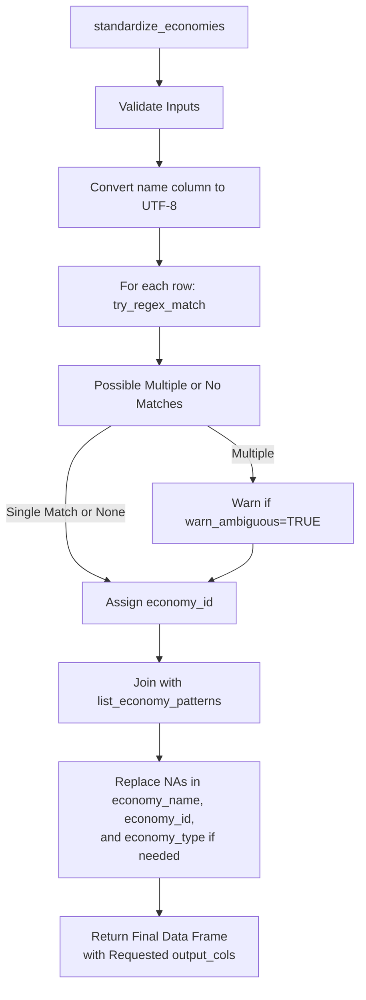

<a href="https://teal-insights.github.io/r-econid"></a>

# econid
<!-- badges: start -->
[](https://github.com/Teal-Insights/r-econid/actions/workflows/R-CMD-check.yaml)
<!-- badges: end -->

## Overview

The `econid` R package is a foundational building block of the [econdataverse](https://econdataverse.org) family of packages aimed at helping economists and financial professionals work with sovereign-level economic data. The package is aimed at domain experts in economics and finance who need to analyze and join data across multiple sources, but who aren't necessarily R programming experts.

## Motivation

Economic and financial datasets present unique challenges when working with country-level data:

1. **Mixed Entity Types**

Datasets often combine different types of entities in the same "country" column:

   - Countries and sovereign states
   - Territories and administrative regions (e.g., Puerto Rico, Hong Kong)
   - Geographic or economic aggregates (e.g., "Sub-Saharan Africa", "Low Income Countries")
   - International institutions (e.g., "World Bank", "IMF")

2. **Inconsistent Naming**

The same entity might appear in various formats:

   - Different codes (ISO-2, ISO-3, numeric codes)
   - Various name formats (e.g., "United States", "US", "U.S.A.")
   - Historical names or non-English variants

3. **Complex Analysis Needs**

Researchers often need to:

   - Compare individual countries with regional aggregates (e.g., Nigeria vs. Sub-Saharan Africa)
   - Join data across datasets with different naming conventions
   - Handle ambiguous cases (e.g., "Congo" could refer to multiple countries)
   - Work with specialized entities not in standard ISO lists

`econid` addresses these challenges through:

- Robust name standardization with clear entity type identification
- Flexible customization options for special cases
- Warning systems for missing or ambiguous matches
- Tools for fuzzy searching, filtering, and joining across datasets

## Design Philosophy

The design philosophy of the package follows [tidyverse principles](https://www.tidyverse.org/principles/) and the [tidy tools manifesto](https://www.tidyverse.org/manifesto/). We strive to practice human-centered design, with clear documentation and examples and graceful handling of edge cases. We invite you to submit suggestions for improvements and extensions on the package's [Github Issues](https://github.com/Teal-Insights/r-econid/issues) page.

We have designed the package to handle only the most common entities financial and economic professionals might encounter in a dataset (249 in total), not to handle every edge case. However, the package allows users to extend the standardization list with custom entities to flexibly accommodate any unconventional use case.

## Installation

Until the package is published on CRAN, you can install it from GitHub using the `remotes` package.

```r
remotes::install_github("Teal-Insights/r-econid")
```

Then, load the package in your R session or Quarto or RMarkdown notebook:

``` {r}
library(econid)
```

## Usage

Below is a high-level overview of how `econid` works in practice, followed by a more detailed description of the main function and its parameters. The examples and tests illustrate typical usage patterns.

### Package Summary

1. **Input validation**  
   The package checks if your input dataset and specified columns exist. It also ensures you only request valid output columns (e.g., `"economy_name"`, `"economy_id"`, `"economy_type"`, `"iso2c"`, and `"iso3c"`). Any invalid columns raise an error.

2. **Name and code matching**  
   The function `standardize_economies()` looks in your dataset for names (and optionally codes) that might match an economy. It:
   - Converts the names to UTF-8 for consistent processing.
   - Calls internal functions to try matching each entry via case-insensitive regex patterns.
   - If both a code column and name column are provided, it attempts to match on both and merges results (favoring the first match).  
   - If multiple matches exist for a single row, a warning is raised (unless suppressed).

3. **Merging standardized columns**  
   Once the function finds a match, it returns a new or augmented data frame with standardized columns (e.g., `"economy_id"`, `"economy_name"`, `"economy_type"`, etc.). You control exactly which standardized columns appear via the `output_cols` argument.

4. **Handling missing and custom cases**  
   - Custom economies can be added using `add_economy_pattern()` before standardization
   - When an economy cannot be matched, it retains the original input name in the `"economy_name"` column (if requested) and shows `NA` in `"economy_id"`.  
   - You can optionally specify a default economy type for unmatched entries (`default_economy_type`).
   - Warnings are issued for ambiguous or incomplete matches if `warn_ambiguous` is `TRUE`.

### Program Flow



### `standardize_economies()` Function

``` {r}
df <- data.frame(economy = c("United States", "China", "NotACountry"), code = c("USA", "CHN", "ZZZ"), obs_value = c(1, 2, 3))

standardize_economies(
  data = df,
  name_col = economy,
  code_col = code,
  output_cols = c("economy_id", "economy_name", "economy_type"),
  default_economy_type = NA_character_,
  warn_ambiguous = TRUE
)
```

#### Parameters

- **data**  
  A data frame (or tibble) containing the economies to be standardized.

- **name_col**  
  The unquoted or quoted name of the column in `data` that contains the country or entity names.

- **code_col** *(optional)*  
  An additional column name that might contain ISO or custom codes. When present, the function attempts to match on both this code and the name. If both match, a warning about ambiguity is issued.

- **output_cols** *(optional)*  
  A character vector of columns to include in the final output. Valid options:
  - `"economy_id"`  
  - `"economy_name"`  
  - `"economy_type"`  
  - `"iso3c"`  
  - `"iso2c"`  
  
  Defaults to `c("economy_id", "economy_name", "economy_type")`.

- **default_economy_type** *(optional)*  
  A character scalar (`"country"`, `"institution"`, or `"aggregate"`, etc.) to assign as the economy type where no match is found. This value only applies if `"economy_type"` is requested in `output_cols`.

- **warn_ambiguous** *(optional)*  
  A logical indicating whether to warn if a single row in `data` can match more than one economy. Defaults to `TRUE`.

#### Returns

A data frame (or tibble) the same size as `data`, augmented (or merged) with the requested standardized columns.

### `add_economy_pattern()` Function

The `add_economy_pattern()` function allows you to add custom economy patterns to the package. This is useful if you need to standardize economies that are not in the default list.

``` {r}
add_economy_pattern(
  "BJ-CITY",
  "Beijing City",
  economy_type = "other",
  aliases = c("Beijing Municipality")
)

df_custom <- data.frame(economy = c("United States", "Beijing Municipality"))
result_custom <- standardize_economies(df_custom, name_col = economy)
print(result_custom)
```

Use these patterns to explore the package and integrate it into your data cleaning workflows. For finer-grained operations (e.g., fuzzy matching or custom expansions), keep an eye on the package roadmap for future enhancements. We welcome your feedback and contributions!

## Roadmap

- Add a fuzzy join function
- Add a fuzzy filter function
