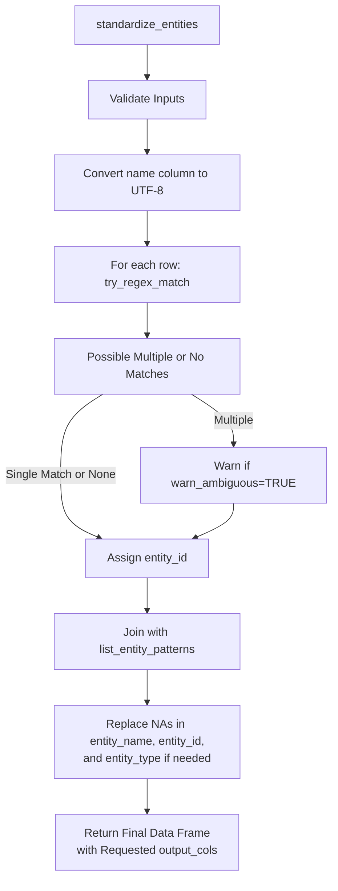

<a href="https://teal-insights.github.io/r-econid"></a>

# econid

<!-- badges: start -->

[](https://github.com/Teal-Insights/r-econid/actions/workflows/R-CMD-check.yaml)
<!-- badges: end -->

## Overview

The `econid` R package is a foundational building block of the
[econdataverse](https://econdataverse.org) family of packages aimed at
helping economists and financial professionals work with sovereign-level
economic data. The package is aimed at domain experts in economics and
finance who need to analyze and join data across multiple sources, but
who aren’t necessarily R programming experts.

## Motivation

Economic and financial datasets present unique challenges when working
with country-level data:

1.  **Mixed Entity Types**

Datasets often combine different types of entities in the same “country”
column:

- Countries and sovereign states
- Territories and administrative regions (e.g., Puerto Rico, Hong Kong)
- Geographic or economic aggregates (e.g., “Sub-Saharan Africa”, “Low
  Income Countries”)
- International institutions (e.g., “World Bank”, “IMF”)

2.  **Inconsistent Naming**

The same entity might appear in various formats:

- Different codes (ISO-2, ISO-3, numeric codes)
- Various name formats (e.g., “United States”, “US”, “U.S.A.”)
- Historical names or non-English variants

3.  **Complex Analysis Needs**

Researchers often need to:

- Compare individual countries with regional aggregates (e.g., Nigeria
  vs. Sub-Saharan Africa)
- Join data across datasets with different naming conventions
- Handle ambiguous cases (e.g., “Congo” could refer to multiple
  countries)
- Work with specialized entities not in standard ISO lists

`econid` addresses these challenges through:

- Robust name standardization with clear entity type identification
- Flexible customization options for special cases
- Warning systems for missing or ambiguous matches
- Tools for fuzzy searching, filtering, and joining across datasets

## Design Philosophy

The design philosophy of the package follows [tidyverse
principles](https://www.tidyverse.org/principles/) and the [tidy tools
manifesto](https://www.tidyverse.org/manifesto/). We strive to practice
human-centered design, with clear documentation and examples and
graceful handling of edge cases. We invite you to submit suggestions for
improvements and extensions on the package’s [Github
Issues](https://github.com/Teal-Insights/r-econid/issues) page.

We have designed the package to handle only the most common entities
financial and economic professionals might encounter in a dataset (249
in total), not to handle every edge case. However, the package allows
users to extend the standardization list with custom entities to
flexibly accommodate any unconventional use case.

## Installation

Until the package is published on CRAN, you can install it from GitHub
using the `remotes` package.

``` r
remotes::install_github("Teal-Insights/r-econid")
```

Then, load the package in your R session or Quarto or RMarkdown
notebook:

``` r
library(econid)
```

## Usage

Below is a high-level overview of how `econid` works in practice,
followed by a more detailed description of the main function and its
parameters. The examples and tests illustrate typical usage patterns.

### Package Summary

1.  **Input validation**  
    The package checks if your input dataset and specified columns
    exist. It also ensures you only request valid output columns (e.g.,
    `"entity_name"`, `"entity_id"`, `"entity_type"`, `"iso2c"`, and
    `"iso3c"`). Any invalid columns raise an error.

2.  **Name and code matching**  
    The function `standardize_entities()` looks in your dataset for
    names (and optionally codes) that might match an entity. It:

    - Converts the names to UTF-8 for consistent processing.
    - Calls internal functions to try matching each entry via
      case-insensitive regex patterns.
    - If both a code column and name column are provided, it attempts to
      match on both and merges results (favoring the first match).  
    - If multiple matches exist for a single row, a warning is raised
      (unless suppressed).

3.  **Merging standardized columns**  
    Once the function finds a match, it returns a new or augmented data
    frame with standardized columns (e.g., `"entity_id"`,
    `"entity_name"`, `"entity_type"`, etc.). You control exactly which
    standardized columns appear via the `output_cols` argument.

4.  **Handling missing and custom cases**

    - Custom entities can be added using `add_entity_pattern()` before
      standardization
    - When an entity cannot be matched, it retains the original input
      name in the `"entity_name"` column (if requested) and shows `NA`
      in `"entity_id"`.  
    - You can optionally specify a default entity type for unmatched
      entries (`default_entity_type`).
    - Warnings are issued for ambiguous or incomplete matches if
      `warn_ambiguous` is `TRUE`.

### Program Flow



### `standardize_entities()` Function

``` r
df <- data.frame(entity = c("United States", "China", "NotACountry"), code = c("USA", "CHN", "ZZZ"), obs_value = c(1, 2, 3))

standardize_entities(
  data = df,
  name_col = entity,
  code_col = code,
  output_cols = c("entity_id", "entity_name", "entity_type"),
  default_entity_type = NA_character_,
  warn_ambiguous = TRUE
)
```

    ##   entity_id   entity_name entity_type        entity code obs_value
    ## 1       USA United States     economy United States  USA         1
    ## 2       CHN         China     economy         China  CHN         2
    ## 3       ZZZ   NotACountry        <NA>   NotACountry  ZZZ         3

#### Parameters

- **data**  
  A data frame (or tibble) containing the entities to be standardized.

- **name_col**  
  The unquoted or quoted name of the column in `data` that contains the
  entity names to be standardized.

- **code_col** *(optional)*  
  An additional column name that might contain ISO or custom codes. When
  present, the function attempts to match on both this code and the
  name. If both match, a warning about ambiguity is issued.

- **output_cols** *(optional)*  
  A character vector of columns to include in the final output. Valid
  options:

  - `"entity_id"`  
  - `"entity_name"`  
  - `"entity_type"`  
  - `"iso3c"`  
  - `"iso2c"`

  Defaults to `c("entity_id", "entity_name", "entity_type")`.

- **default_entity_type** *(optional)*  
  A character scalar (`"economy"`, `"organization"`, `"aggregate"`, or
  `"other"`) to assign as the entity type where no match is found. This
  value only applies if `"entity_type"` is requested in `output_cols`.
  The four valid values were selected to cover the most common economic
  use cases:

  - `"economy"`: A legal or quasi-legal jurisdiction such as a country
    or autonomous region (e.g., “United States”, “Democratic Autonomous
    Administration of North and East Syria”)
  - `"organization"`: An institution or organization such as a bank or
    international agency (e.g., “World Bank”, “IMF”)
  - `"aggregate"`: A geographic or economic aggregate such as a region
    or development group (e.g., “Sub-Saharan Africa”, “Low Income
    Countries”)
  - `"other"`: Anything that doesn’t fit into the other categories
    (e.g., “Elon Musk”, “The Moon”)

- **warn_ambiguous** *(optional)*  
  A logical indicating whether to warn if a single row in `data` can
  match more than one entity. Defaults to `TRUE`.

#### Returns

A data frame (or tibble) the same size as `data`, augmented (or merged)
with the requested standardized columns.

### `add_entity_pattern()` Function

The `add_entity_pattern()` function allows you to add custom entity
patterns to the package. This is useful if you need to standardize
entities that are not in the default list.

``` r
add_entity_pattern(
  "BJ-CITY",
  "Beijing City",
  entity_type = "economy",
  aliases = c("Beijing Municipality")
)

df_custom <- data.frame(entity = c("United States", "Beijing Municipality"))
result_custom <- standardize_entities(df_custom, name_col = entity)
print(result_custom)
```

    ##   entity_id   entity_name entity_type               entity
    ## 1       USA United States     economy        United States
    ## 2   BJ-CITY  Beijing City     economy Beijing Municipality

Use these patterns to explore the package and integrate it into your
data cleaning workflows. For finer-grained operations (e.g., fuzzy
matching or custom expansions), keep an eye on the package roadmap for
future enhancements. We welcome your feedback and contributions!
